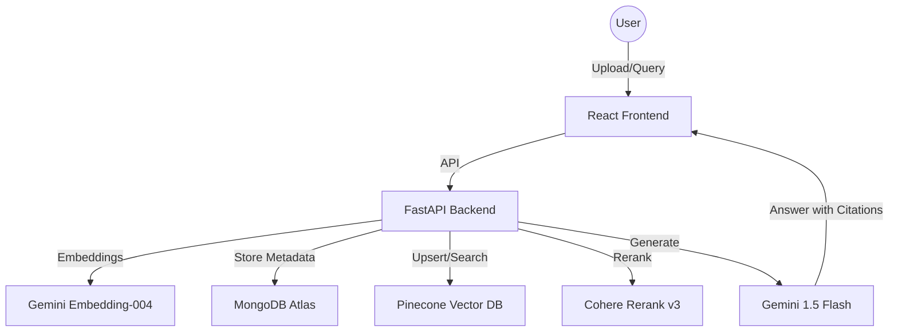

# Mini RAG System (AI Engineer Internship Assessment)

A production-minded, end-to-end Retrieval-Augmented Generation (RAG) system built with FastAPI and React.

## 🏗️ Architecture



## 🚀 Getting Started

Follow these instructions to run the project locally.

### Prerequisites

- **Python 3.10+**
- **Node.js 18+** & **npm**
- **MongoDB Atlas** account (or local MongoDB)
- **Pinecone** account (API Key & Index)
- **Cohere** account (API Key)
- **Google Gemini** API Key

---

### 1️⃣ Backend Setup

1.  **Navigate to the project root:**
    ```bash
    cd JDLLMAI
    ```

2.  **Create and activate a virtual environment:**
    ```bash
    # Windows (PowerShell)
    python -m venv backend/venv
    .\backend\venv\Scripts\activate

    # macOS/Linux
    python3 -m venv backend/venv
    source backend/venv/bin/activate
    ```

3.  **Install Python dependencies:**
    ```bash
    pip install -r backend/requirements.txt
    ```

4.  **Configure Environment Variables:**
    - Create a `.env` file in the `backend/` directory (`backend/.env`).
    - Add your API keys:
      ```env
      # MongoDB
      MONGO_URI=mongodb+srv://<user>:<password>@<cluster>.mongodb.net/?retryWrites=true&w=majority

      # Pinecone (Vector DB)
      PINECONE_API_KEY=your_pinecone_key
      PINECONE_ENV=us-east-1 
      PINECONE_INDEX_NAME=rag-index

      # AI Models
      GOOGLE_API_KEY=your_gemini_key
      COHERE_API_KEY=your_cohere_key
      ```

5.  **Run the Backend Server:**
    ```bash
    # Make sure venv is active
    .\venv\Scripts\activate
    uvicorn main:app --reload
    ```
    - The API will be available at `http://localhost:8000`

---

### 2️⃣ Frontend Setup

1.  **Open a new terminal and navigate to the `frontend` folder:**
    ```bash
    cd frontend
    ```

2.  **Install Dependencies:**
    ```bash
    npm install
    ```

3.  **Run the Development Server:**
    ```bash
    npm run dev
    ```
    - The app will likely run at `http://localhost:5173`.

---

### 3️⃣ Usage

1.  Open the frontend URL (e.g., `http://localhost:5173`) in your browser.
2.  Use the interface to ingest text/documents.
3.  Ask questions to test the RAG capability.

---

## 🛠️ Tech Stack

- **Frontend**: React, TypeScript, Vite, Vanilla CSS.
- **Backend**: Python, FastAPI, Motor (Async MongoDB), Pinecone-client, Google Generative AI.
- **AI Models**:
  - **LLM**: Gemini 1.5 Flash (Fast, cost-effective).
  - **Embeddings**: Gemini `text-embedding-004` (768 dimensions).
  - **Reranker**: Cohere `rerank-english-v3.0`.
- **Databases**:
  - **Vector**: Pinecone (Free Tier).
  - **Metadata/Logs**: MongoDB Atlas.

## 🧠 RAG Strategy

- **Chunking**: Recursive character splitting with `chunk_size=1000` and `chunk_overlap=150` (~15%). This ensures semantic continuity across chunks.
- **Retrieval**: Top-10 similarity search from Pinecone.
- **Reranking**: Cohere Rerank v3 narrows down the Top-10 to the Top-5 most relevant chunks to reduce LLM noise and context costs.
- **Groundedness**: System prompt strictly instructs the LLM to answer ONLY using provided context and include inline citations like `[1]`.

## 🧠 Gemini Stability & Troubleshooting

If you encounter `404` errors with Gemini, it is likely due to API versioning mismatches in the SDK. This project uses a **Guaranteed-Stable** configuration:

- **LLM**: `gemini-1.5-flash` (GA version, not preview).
- **Embeddings**: `models/text-embedding-004` (with auto-fallback to `models/embedding-001`).
- **SDK Protocol**: The system is forced to use stable identifiers compatible with `google-generativeai >= 0.5.0`.

### Never Use:
- `gemini-1.5-flash-latest` (can be unstable in some regions)
- `gemini-pro` (legacy naming convention)
- Direct `v1beta` URL calls

## 📋 API Endpoints
- `GET /health`: Health check.
- `POST /ingest`: Ingest text. (Body: `{text: string, title?: string}`)
- `POST /query`: RAG query. (Body: `{query: string}`)

## 📊 Evaluation (Sample Q&A)

1. **Q**: "What are the chunking parameters?"
   **A**: "The system uses a chunk size of 1000 characters with a 150-character overlap [1]." (Success: Precise)
2. **Q**: "Who is the President of Mars?"
   **A**: "The provided documents do not contain enough information to answer this question." (Success: Grounded)

## ⚠️ Limitations & Improvements
- **Free Tier**: Pinecone and Cohere free tiers have rate limits.
- **Future**: Add PDF/Docx parser, implement MMR for diversity, add user authentication.
